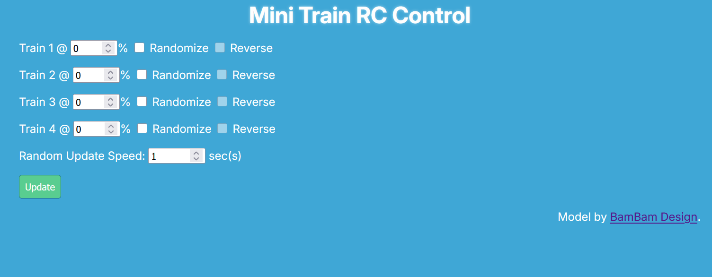
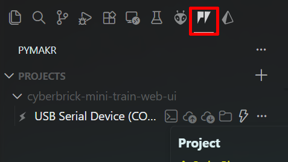
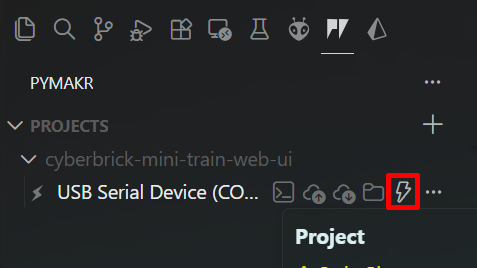
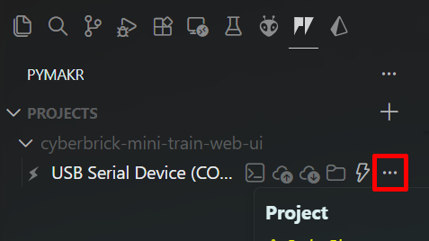
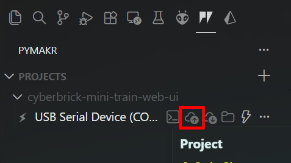

# CyberBrick Mini Train custom application

This software, when flashed to a CyberBrick Multi-Function Core Board, will convert it into a custom web server for the [CyberBrick Motor Box for Mini Train](https://makerworld.com/en/models/1886257-cyberbrick-motor-box-for-mini-train-diorama).

You can control all aspects of the model from any device with a web browser without the need for a CyberBrick remote transmitter. Configuration is saved to flash and loaded on startup, so your settings persist between boots.

## Screenshot

## Installation

1. Install [Visual Studio Code](https://code.visualstudio.com/), [Node.js](https://nodejs.org/en/download/lts), and [Git for Windows](https://git-scm.com/install/windows).
2. In VS Code, install the [Pymakr extension](https://marketplace.visualstudio.com/items?itemName=pycom.Pymakr).
3. In VS Code, open the `src/app_train` folder.
4. Remove the Multi-Function Core Board from the model and connect it to your computer. You should see a green LED assuming the RC application has been flashed.
5. Add the device to the project in the Pymakr tab (quotation mark icon).
6. Set your WiFi credentials in http_main.py. **NOTE**: The ESP32 only supports 2.4Ghz networks.
7. Open a terminal in VS Code and run `./build.sh` (if Bash), `build.bat` if cmd, or `.\build.bat` if PowerShell.
8. In the Pymakr tab, connect to your device and use the "Stop script" action from the "..." menu. The green LED on the MFCB will change to a flashing purple. Click the "Sync project to device" icon and wait for the files to copy to the MFCB.

1. Disconnect the MFCB from your computer and reinstall it in the receiver board.
2. Turn the model on and wait ~10 seconds for WiFi connection.
3. Once you see the device on the network (its hostname will start with `mpy-` and end with `esp32c3`), you can access it over HTTP at its IP address.
4. Use the provided web page to control the train speeds, direction, update speed, and volcano LED.

## Uninstallation

To revert back to the original RC application, simply use the CyberBrick app to send the Motor Box configuration to the receiver and reflash it when prompted.

## Known Issues

If you submit the form twice at once (i.e. clicking Update twice without waiting for the page to refresh) the web server can become stuck. If so, you will need to turn the model off and back on again.
